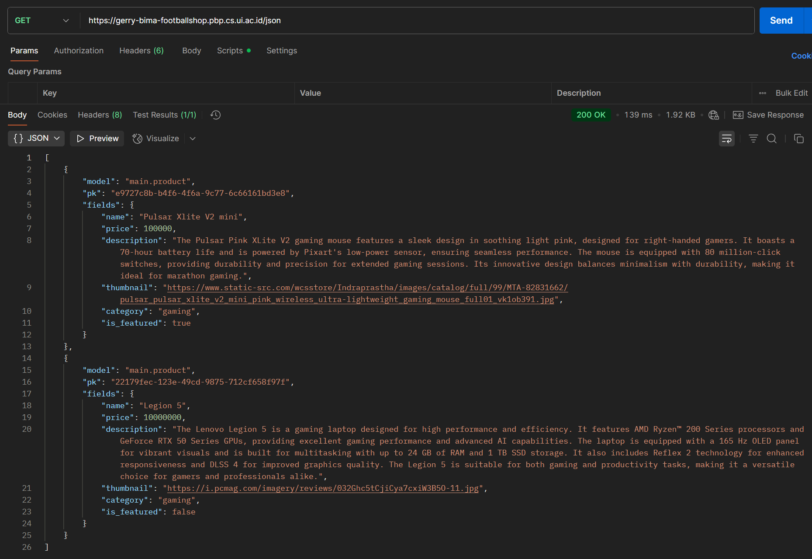
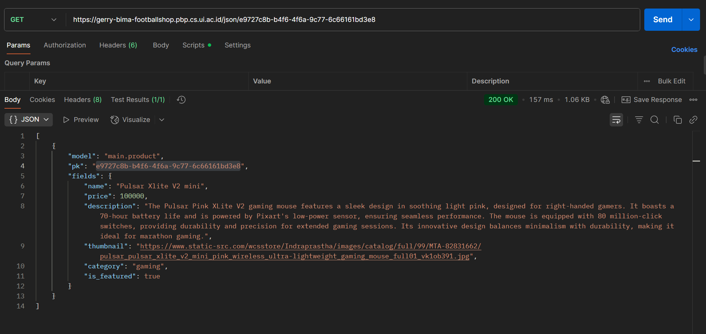
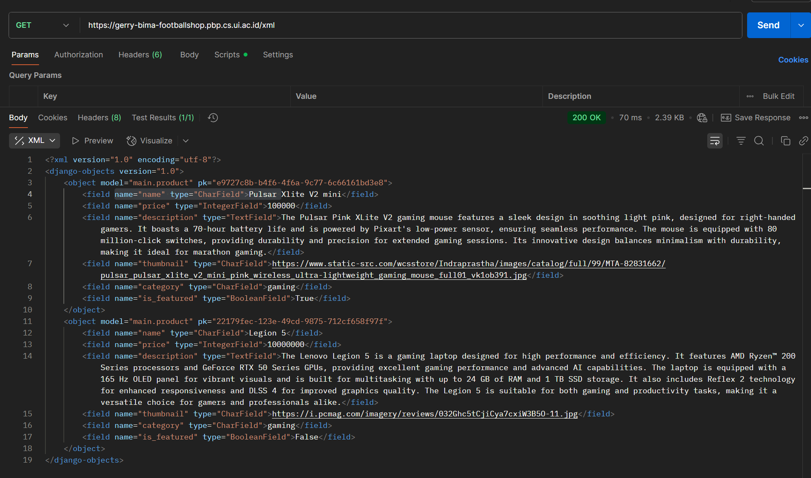
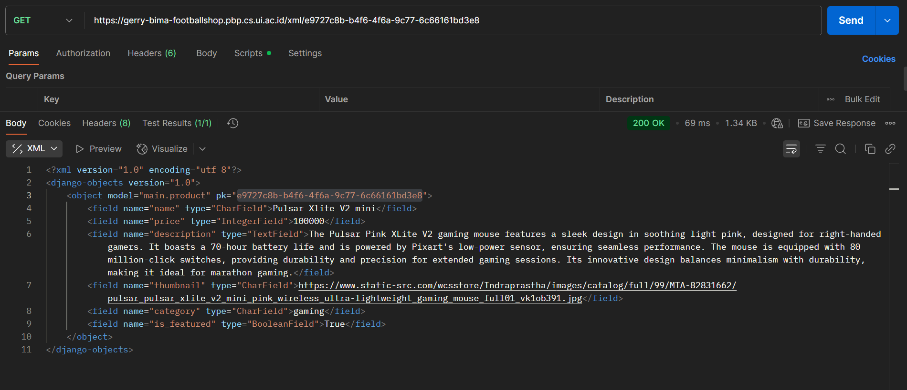

https://gerry-bima-footballshop.pbp.cs.ui.ac.id/

#Tugas2

- Membuat sebuah proyek Django baru: untuk membuat project django baru pertama saya membuat environment untuk mengisolasi depedencies yang akan saya install. Lalu saya membuat requirement.txt yang berisi depedencies yang diperlukan project django saya. Setelah itu menjalankan "pip install -r requirements.txt", dilanjut dengan konfigurasi .env dan env.prod untuk mengakses database. Dan diakhiri dengan menghubungkan ke repository github.

- Membuat aplikasi dengan nama main pada proyek tersebut: untuk membuat directory baru bernama "main" dapat dengan command "python manage.py startapp main" dan didaftarkan ke INSTALLED_APPS di settings.py, directory ini digunakan untuk struktur project.

- Melakukan routing pada proyek agar dapat menjalankan aplikasi main: Untuk menghubungkan 'main' ke directory utama perlu mengedit urls.py di directory utama dengan mengimport include dari django.urls. Didalam urlpattern isi dengan fungsi path('route', include('directory_urls.py (main.urls)')).

- Membuat model pada aplikasi main dengan nama Product dan memiliki atribut wajib: mengisi model.py didalam directory main dengan class yang kita inginkan (Product) dengan class dasar models.Model yang diimportt dari django.db. Lalu didalam class-nya, menambahkan atribut yang diinginkan sesuai dengan tipe data yang diinginkan.

- Membuat sebuah fungsi pada views.py untuk dikembalikan ke dalam sebuah template HTML yang menampilkan nama aplikasi serta nama dan kelas kamu: untuk langkah ini dimulai dengan import render dari django.shortcuts di views.py directory main. Lalu membuat fungsi dengan parameter request, buat fungsi ini mereturn render(request, "nama_file_html", object data yang ingin di kirim). Setelah itu buat folder baru bernama templates di 'main' untuk tempat file html-nya. Lalu buat struktur html yang diinginkan dengan menggunakan variable object yang sudah dikirim viws.py.

- Membuat sebuah routing pada urls.py aplikasi main untuk memetakan fungsi yang telah dibuat pada views.py: untuk langkah ini, pertama-tama buat urls.py di directory main dengan mengimport path dari django.urls dan fungsi dari views.py yang ingin di perlihatkan. Dilanjut dengan membuat list berisi object URLPattern yang dihasilkan dari fungsi path('route', fungsi_views.py).

- Melakukan deployment ke PWS terhadap aplikasi yang sudah dibuat sehingga nantinya dapat diakses oleh teman-temanmu melalui Internet: Sesuai ketentuan dari Pacil Web Service untuk melakukan deploy perlu membuat project baru pws lalu mengisi variable di environs sesuai dengan .env.prod lalu melakukan command sesuai ketentuan dari pws: 'git remote add pws ....', 'git branch -M master', lalu 'git push pws master'. sebelum push di settings.py pada ALLOWED_HOST tambahkan url deployment PWS.

Bagan request client web aplikasi berbasis Django:
HTTP Request -> URLS(urls.py) -> View(views.py) <-> Model(models.py)  
Template(.html) -> Vieww(views.py) -> HTTP Response (HTML)
Model: berisi struktur data dan tabel database. Berhubungan dengan View dengan read/write data.
View: berisi class dan fungsi yang untuk membuat algoritma dari project. Berhubungan dengan Model dengan read/write data.
URLS: menentukan URL route yaitu view mana yang dipanggil ketika user mengakses suatu url. Berhubungan dengan view untuk mengirim request.
Template: Digunakan untuk menampilkan data dari view ke user dengan struktur HTML. Berhubungan dengan view untuk mengakses data object.

Jelaskan peran settings.py dalam proyek Django? Peran settings.py adalah untuk konfigurasi project seperti app yang akan digunakan di INSTALLED_APPS, MIDDLEWARE untuk menangani request sebelum/sesudah sampai ke view, DATABASES untuk konfigurasi koneksi ke database, ALLOWED_HOSTS untuk menentukan yang bisa mengakses project.

Bagaimana cara kerja migrasi database di Django? proses migrasi terjadi saat melakukan perubahan di models.py. dengan menjalankan perintah 'python manage.py makemigrations' django akan membaca perubahan di models.py lalu membuat file migrasi di folder migrations/ yang berisi instruksi python mendeskripsikan perubahan model.py. jika sudah yakin dengan perubahannya, dengan menjalankan 'python manage.py migrate' perubahan pada models.py sudah tersimpan dan terbaca di project.

Menurut Anda, dari semua framework yang ada, mengapa framework Django dijadikan permulaan pembelajaran pengembangan perangkat lunak?

1. Framework django sudah mempunyai fitur-fitur yang cukup untuk mengembangkan website seperti autentikasi user, admin panel, ORM (Object-Relational Mapping), routing, middleware, template engine, dsb. Jadi programmer permula cukup fokus ke konsep utama pengembangan aplikasi.
2. Django menggunakan aturan MVT (model view template) yang mudah dipahami dan membantu programmer pemula memahami arsitektur perangkat lunak.
3. Menggunakan Python yang termasuk high level languange yang mudah dipahami programmer pemula
4. ORM, dengan ORM untuk menghubungkan database, proses penggunaan database menjadi mudah.

Apakah ada feedback untuk asisten dosen tutorial 1 yang telah kamu kerjakan sebelumnya? Tutorial sudah sangat lengkap dan diisi dengan bahasa yang mudah dipahami, jadi overall sudah bagus.

#Tugas3

Jelaskan mengapa kita memerlukan data delivery dalam pengimplementasian sebuah platform?
Dalam sebuah platform data sangatlah penting untuk memastikan semua variable terisi dan bisa diperlihatkan. Untuk itu proses data delivery diperlukan agar data bisa sampai tujuan dengan aman, akurat, dan tidak terubah. Dalam projek django, ORM berperan besar karena mengubah objek python menjadi data yang dipahami database, dan sebaliknya.

Menurutmu, mana yang lebih baik antara XML dan JSON? Mengapa JSON lebih populer dibandingkan XML?
menurutku JSON lebih baik, JSON adalah singkatan dari JavaScript Object Notation dan saya lebih terbiasa membaca object javascript daripada xml. Alasan mengapa JSON lebih populer dari XML adalah karena beberapa faktor, diantaranya: 
- Sintaks yang Ringkas dan Mudah Dibaca: Sintaks JSON menggunakan pasangan "key-value" yang sederhana dan mudah dibaca, mirip dengan objek JavaScript. Sebaliknya, XML menggunakan tag pembuka dan penutup yang membuatnya lebih bertele-tele (verbose) dan kurang ringkas. 
- Integrasi yang Lebih Baik dengan JavaScript: Karena JSON adalah singkatan dari "JavaScript Object Notation," ia secara alami cocok dengan JavaScript. Pengembang dapat langsung mengonversi string JSON menjadi objek JavaScript tanpa perlu parser yang rumit, yang membuat proses pengembangan jauh lebih cepat.
- Parsing yang Lebih Cepat: Karena sintaksnya yang lebih sederhana dan ukuran file yang lebih kecil, JSON dapat di-parsing lebih cepat. Dalam aplikasi yang sangat bergantung pada pertukaran data real-time, seperti API, kecepatan ini adalah keuntungan besar.
- Ideal untuk API: Sebagian besar API modern (RESTful API) menggunakan JSON sebagai format pertukaran data utama. Format ini sangat efisien untuk mengirimkan data terstruktur antara server dan klien (misalnya, browser web atau aplikasi seluler) dengan overhead minimal.

Jelaskan fungsi dari method is_valid() pada form Django dan mengapa kita membutuhkan method tersebut?
method is_valid disini digunakan dalam views.py di kode 'if form.is_valid() and request.method == "POST":' form adalah object dari class ProductForm di forms.py. form.is_valid() diperlukan untuk mengecek apakah semua kolom data sudah diisi dengan benar oleh user (tidak dikosongkan dan sesuai tipe data), jika sudah benar akan mereturn true jika tidak false.

Mengapa kita membutuhkan csrf_token saat membuat form di Django? Apa yang dapat terjadi jika kita tidak menambahkan csrf_token pada form Django? Bagaimana hal tersebut dapat dimanfaatkan oleh penyerang?
csrf_token disini digunakan untuk memastikan bahwa submit form berasal dari request user di create_product.html dengan melakukan validasi apakah token sudah sama dengan token yang di generate otomatis oleh django. Jika tidak ada csrf_token django tidak bisa memverifikasi apakah submit form benar-benar dari user, yang bisa dimanfaatkan oleh penyerang untuk memasukkan sembarang data ke database kita.

Penjelasan checklist step by step:

- Tambahkan 4 fungsi views baru untuk melihat objek yang sudah ditambahkan dalam format XML, JSON, XML by ID, dan JSON by ID: Menambahkan fungsi show_xml dengan parameter request yang berisi product_list yaitu data dari semua produk lalu diubah kedalam time xml. Menambahkan fungsi show_json dengan parameter request yang sama dengan show_xml tetapi product_list diganti ke json. Menambahkan show_xml_by_id dengan parameter request dan product_id yang berisi percobaan mengambil data produk berdasarkan product_id dengan .filter(), jika ada di ubah kedalam bentuk xml seperti sebelumnya. Menambahkan fungsi show_json_by_id yang mirip seperti show_xml_by_id namun data diubah ke bentuk json.

- Membuat routing URL untuk masing-masing views yang telah ditambahkan pada poin 1: untuk membuat routing kira perlu menambahkan kode di urls.py. pertama-tama import keempat fungsi yang sudah dibuat, lalu gunakan path() yang diimport dari django.urls untuk menentukan path dari fungsi tersebut.

- Membuat halaman yang menampilkan data objek model yang memiliki tombol "Add" yang akan redirect ke halaman form, serta tombol "Detail" pada setiap data objek model yang akan menampilkan halaman detail objek: disini saya menambahkan beberapa baris kode ke main.html dengan block code, diantaranya: logika 'if not product_list' yang isisnya ditampilkan jika product_list kosong, lalu 'for product in product_list' untuk interasi object product di product_list dan menampilkan variable dari objectnya satu persatu. untuk tombol "Add" saya menambahkan <a> yang terhubung ke create_product dan terisi dengan <button>.

Membuat halaman form untuk menambahkan objek model pada app sebelumnya: agar halaman form nanti bisa mempunyai fungsi untuk mengisi object Product, perlu membuat fungsi baru di views yaitu create_product(request) fungsi ini menggunakan class ProductForm(modelForm) yang saya buat di forms.py, class ini digunakan untuk struktur data yang akan di sumbit. Dengan menggunakan validasi is_valid() data bisa tersubmit dengan benar. Yang penting juga menambahkan csrf_token agar django bisa memverifikasi bahwa request submit dari user.

Membuat halaman yang menampilkan detail dari setiap data objek model: agar halaman bisa menampilkan produk yang diinginkan, saya memverifikasinya dengan id dengan fungsi show_product yang menerima parameter id, lalu menggunakan get_object_or404() yang diimport dari django.shortcuts dan mempassing dengan render() ke halaman untuk detail produk. Untuk halaman detail produk saya membuat product_detail.html karena sudah menerima object produk hanya tinggal membuat struktur html untuk menampilkan variable product.

Screenshot postman:

https://gerry-bima-footballshop.pbp.cs.ui.ac.id/json

https://gerry-bima-footballshop.pbp.cs.ui.ac.id/json/e9727c8b-b4f6-4f6a-9c77-6c66161bd3e8

https://gerry-bima-footballshop.pbp.cs.ui.ac.id/xml

https://gerry-bima-footballshop.pbp.cs.ui.ac.id/xml/e9727c8b-b4f6-4f6a-9c77-6c66161bd3e8

Untuk feedback tutorial 2 overall lancar dan aman.

